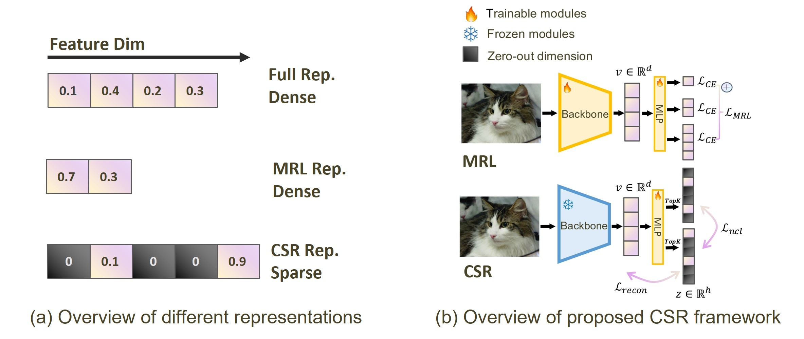

#  [Beyond Matryoshka: Revisiting Sparse Coding for Adaptive Representation](http://arxiv.org/abs/2503.01776) (ICML 2025)
By [Tiansheng Wen\*](https://neilwen987.github.io/), [Yifei Wang\*](https://yifeiwang77.com/), [Zequn Zeng](https://joeyz0z.github.io/), Zhong Peng, Yudi Su, [Xinyang Liu](https://xinyangatk.github.io/),
[Bo Chen](https://web.xidian.edu.cn/bchen/en/index.html), Hongwei Liu, [Stefanie Jegelka](https://people.csail.mit.edu/stefje/) and [Chenyu You](https://chenyuyou.me/)

<a href='https://arxiv.org/abs/2503.01776'></a>



In this paper, we show that *sparse coding* offers a compelling alternative for achieving adaptive representation with minimal overhead and higher fidelity. We propose **C**ontrastive **S**parse **R**epresentation, a method that sparsifies pre-trained embeddings into a high-dimensional but *selectively activated* feature space. By leveraging lightweight autoencoding and task-aware contrastive objectives, CSR preserves semantic quality while allowing flexible, cost-effective inference at different sparsity levels. Extensive experiments on image, text, and multimodal benchmarks demonstrate that CSR consistently outperforms MRL in terms of both accuracy and retrieval speed-often by large margins-while also cutting training time to a fraction of that required by MRL. Our results establish sparse coding as a powerful paradigm for adaptive representation learning in real-world applications where efficiency and fidelity are both paramount. 

## 🧬 Source Repository

This project is built on top of prior research and infrastructure from the Y Research team.

👉 [Y Research](https://github.com/Y-Research-SBU/CSR)

Please refer to the Y Research repo for more details.

## &#x1F680; &#x1F680; News
- 2025.06.06 [More ckpts](https://drive.google.com/drive/folders/1KNidBRzChAg3g4MuTO7K8Hz46HiGz0rv) are released!! &#x1F601;&#x1F601;
- 2025.05.25 **Major Update**. We have thoroughly reorganized our repository with the following changes: 🎉🎉
  - Minor code changes on Visual Experiments, especially dataset preparation.
  - Training & Evaluation Pipeline for Text Experiments, including text classification, text clustering and text retrieval.
  - Minor changes in codes for Multimodal Experiments.
  - More detailed instructions for Data Preparation & Training & Evaluation.
- 2025.04.25 Training & Evaluation Pipeline for Multimodal Retrieval is Now Live! We further provide pre-computed ImageNet1k embeddings at [Dataset Link](https://huggingface.co/datasets/W1nd-navigator/CSR-precompute-embeds) for easy follow up! 🙌🙌
- 2025.03.25 Evaluation framework for multimodal retrieval tasks is now online!! &#x1FABC;&#x1FABC;
- 2025.03.07  [Weights](https://drive.google.com/drive/folders/1fI4ip-tcjSrmXtFANmIDTh1wERPlfySO?usp=sharing)
 for visual embeds(k=8 & 32), multimodal embeds(k=64) are now online!! &#x1F601;&#x1F601;
- 2025.03.05  Code released! Let's embrace sparsity!! &#x1F389;&#x1F389;

In this repo, we will release (**updating**):

- Environment Dependencies &#x2705;
- Checkpoints &#x2705;
  - Visual ckpt (on ImageNet) &#x2705;
  - Text ckpt (on partly MTEB datasets) &#x2705;
  - MutilModal ckpt (on MS COCO) &#x2705;
- Reproducing Experiments &#x2705;
  - Visual Exp &#x2705;
    - Dataset preparations &#x2705;
    - Training &#x2705;
    - Evaluation &#x2705;
  - Text Exp;
    - Dataset preparations &#x2705;
    - Training &#x2705;
    - Evaluation &#x2705;
  - MultiModal Exp &#x2705;
    - Dataset preparations &#x2705;
    - Training &#x2705;
    - Evaluation &#x2705;
  - Retrieval Time Evaluation &#x2705;
- loading CSR with [Sentence Transformers](https://github.com/UKPLab/sentence-transformers) &#x1F4CC;

## Set up
You only need to prepare an empty conda environment with Python 3 (reference version: Python 3.8.20) and `pip install` the `requirements.txt` file in this directory.
```sh
conda create --name csr python=3.8.20
pip install -r requirements.txt
```

## Vision Representation
First, please move to our `vision_representation` codebase directory.
```shell
cd ./vision_representation/
```
### Get Imagenet1k embeds
#### Way I (Recommended): Get pre-compute embeds from Huggingface🤗
We provide embeds extracted by FF2048 backbones (same backbone weights with MRL), and embeds by [SoTA backbone](https://huggingface.co/timm/resnet50d.ra4_e3600_r224_in1k) at [Dataset Link](https://huggingface.co/datasets/W1nd-navigator/CSR-precompute-embeds) .
#### Way II: Prepare embeds from start
To train CSR with different visual backbones, please follow the preparation steps below.
##### Prepare Imagenet1k dataset
**Step I**: Download Imagenet1k dataset and bounding box annotations from [Imagenet1k Official Website](https://www.image-net.org/).

**Step II**: Convert the original dataset to [Pytorch style](https://github.com/MadryLab/pytorch-imagenet-dataset).
```shell
# Prepare the annotations.txt file for both training and validation set
python ./dataset_preparation annotations.py --xml_dir "/path/to/train/annotation/directory" --output_file "/path/to/annotation.txt/directory"
# Convert original dataset to Pytorch style
python ./dataset_preparation to_pytorch_style.py --split_path "/path/to/pytorch/style/dataset"
```
**Step III**: Follow the pipeline of [FFCV](https://github.com/libffcv/ffcv-imagenet) for ResNet50 to generate the dataset with the following command (`IMAGENET_DIR` should point to a Pytorch style [ImageNet dataset](https://github.com/williamFalcon/pytorch-imagenet-dataset)).
```shell
cd dataset_preparation
# Required environmental variables for the script:
export IMAGENET_DIR=/path/to/pytorch/format/imagenet/directory/
export WRITE_DIR=/your/path/here/

# Serialize images with:
# - dataset type: train/val
# - 500px side length maximum
# - 50% JPEG encoded, 90% raw pixel values
# - quality=90 JPEGs
./write_imagenet.sh "train" 500 0.50 90
./write_imagenet.sh "val" 500 0.50 90
```
##### Get Pre-trained ImageNet1k Embeddings
For training and evaluation simplicity, we precompute image embeddings using models from [Timm](https://github.com/huggingface/pytorch-image-models).
In our paper, we select [resnet50d.ra4_e3600_r224_in1k](https://huggingface.co/timm/resnet50d.ra4_e3600_r224_in1k) as our pre-trained visual backbone. To extract embeddings, run the following command: 
```shell
python pretrained_embeddings.py \
	--train_data_ffcv  /path/to/train.ffcv \
	--eval_data_ffcv    /path/to/val.ffcv \
	--model_name "pre-trained visual backbone" \
```

Then stack embeds together:
```shell
python stack_emb.py
```
> Note:  We did this only in consideration of memory constrain on our computer, otherwise you can directly infer the entire training embeds without stack operation.
### Train Contrastive Sparse Representation on Imagenet1K
After getting embeds, you can train CSR with `main_visual.py`. You must customize the `pretrained_emb` (Path to the embeds) and `model_name` (`timm` model's name). For other parameters, you can both follow the default settings and customize them. The trained models will be saved to `./ckpt/CSR_topk_{args.topk}/`.
```sh
python main_visual.py \
      --pretrained_emb /path/to/pretrained_emb \
      --model_name "pre-trained visual backbone" \
      --use_ddp False \     # set True if you want to use multi-GPU
      --gpu 1 \              # GPU ID, set None if you use multi-GPU
      --batch-size 1024 * 4 \
      --lr 4e-4 \
      --use_CL True \       # whether to use contrastive learning
      --topk 8 \            # topk for CSR
      --auxk 512 \          # auxiliary sparse code size
      --hidden-size 8192 \  # By default, 4 * visual backbone embedding size
```
### Get CSR embeddings for Evaluation
You can get CSR embeddings with `csr_inference.py`. You must customize the `train_embed_path`, `eval_emb_path` and `csr_ckpt`. The embeds will be saved in `./retrieval/` by default. **Note:** Considering that the CSR embeddings are too large, we split them into chunks stored in the same directory with `chunk_original_npz_file.py`. Minor code change is needed in method `generate_retrieval_data` in `utils.py` is needed if you prefer inference with single `.npz` file.
```sh
# Chunk original embeddings
python chunk_npz_file.py \
	--input_path "Path/to/original/embeddings" \
	--output_path "Path/to/chunk/directory" \
	--chunk_size "Number of samples per chunk"
# Inference
python csr_inference.py \
      --train_emb_path  /path/to/train_emb \
      --eval_emb_path    /path/to/val_emb \
      --model_name "pre-trained visual backbone" \
      --topk 8\
      --hidden-size 8192  # By default, 4 * visual backbone embedding size
      --csr_ckpt "CSR ckpt path"\
```
### Get Evaluation Results
We use [FAISS](https://github.com/facebookresearch/faiss) for KNN evaluation and calculate Top1 Accuracy under different sparsity conditions. It should be noted that this evaluation process runs on a 128-CPU server, requires approximately 150GB of memory, and takes about 20 minutes to complete. Further optimization is needed, and we welcome collaboration. You only need to set `--topk` if all generated files are not moved.
```shell
# Get FAISS index
python ./retrieval/faiss_nn.py --topk 8
# Evaluate Top1 accuracy
python ./retrieval/compute_metrics.py --topk 8
```

## Text Representation
We focus on three kinds of tasks for comparison: **Text Classification**, **Text Clustering** and **Text Retrieval**. First, please move to our `text_representation` codebase directory.
```sh
cd ./Text
```
### Text Classification
We focus on three datasets for classification: [MTOPIntent](https://huggingface.co/datasets/mteb/mtop_intent), [Banking77](https://huggingface.co/datasets/mteb/banking77) and [tweetSentiment](https://huggingface.co/datasets/mteb/tweet_sentiment_extraction).
#### Data Preparation
We download these datasets from hugging face to `./datasets` directory. You can use `load_dataset` API if you like (minor changes to code may be needed). If you follow our way of data preparation, no extra change to original data is necessary. For instance, `banking77` directory should be organized in the following format:
```
./banking77
├── README.md
├── data
│   ├── test-00000-of-00001.parquet
│   └── train-00000-of-00001.parquet
├── prepare_data.py
├── test.jsonl
└── train.jsonl
```
#### Get embeddings
You can get  our pre-computed [NV-Embed-v2](https://huggingface.co/nvidia/NV-Embed-v2) embeddings from [Dataset Link](https://huggingface.co/datasets/W1nd-navigator/CSR-precompute-embeds). Or you can use `./get_embeddings/get_classification_embeddings.py` to generate your own embeddings.
```sh
cd get_embeddings/
python get_classification_embeddings.py \
	--dataset "Dataset_name" \  # Dataset to process
	--language None \ # Required for MTOP_Intent dataset
	--split None # default: all splits
```
#### Train Contrastive Sparse Representation
After getting embeddings, you can train CSR with `train_CSR_models.py`. You need to customize `--task_name`, `--pretrained_embed` and `--gpu`. 
```sh
python train_CSR_models.py \
        --task_name $TASK_NAME \   # the dataset you want to train CSR on.
        --pretrained_emb /path/to/your/embeddings \   # path to embeddings for training
        --gpu $DEVICE \   # the device to train CSR
        --batch-size 128 \
        --lr 4e-5 \
        --topk 32 \
        --auxk 1024 \
        --hidden-size 16384 \
        --embed_dim 4096
```

#### Get CSR embeddings for Evaluation
You can get CSR embeddings with `text_classification_csr_inference.py`. You must customize `--train_emb_path` (path to training dataset embeddings), `--val_emb_path` (path to validation dataset embeddings) and `--csr_ckpt` (path to CSR model).

```sh
python ./text_classification_csr_inference.py \
      --train_emb_path /path/to/training/dataset/embeddings \
      --val_emb_path /path/to/validation/dataset/embeddings \
      --topk 32 \
      --hidden-size 16384 \
      --csr_ckpt /path/to/CSR/model
```

#### Get Evaluation Results
We use **Top-1 Acc (%)** as the text classification evaluation metrics. The training set embeddings are used to train a logistic regression classifier, which is scored on the test set. You only need to customize the `--training_embedding_path` and `--test_embedding_path`.
```sh
python ./evaluation_on_textclassification.py \
	--training_embedding_path "Path/to/Training/Set/embeddings" \
	--test_embedding_path "Path/to/Test/Set/Embeddings" \
	--n_jobs -1 \
	--verbose 0 \
	--max_iter 2000
```

### Text Clustering 
We focus on three datasets for clustering: [BiorxivP2P](https://huggingface.co/datasets/mteb/biorxiv-clustering-p2p), [BiorxivS2S](https://huggingface.co/datasets/mteb/biorxiv-clustering-s2s) and [TwentyNews](https://huggingface.co/datasets/mteb/twentynewsgroups-clustering).
#### Data preparation
Please follow the data preparation pipeline in Text Classification. For instance, `biorxiv-clustering-p2p` directory should be organized in the following format:
```shell
./biorxiv-clustering-p2p
├── README.md
└── test.jsonl
```
#### Get embeddings
You can get our pre-computed [NV-Embed-v2](https://huggingface.co/nvidia/NV-Embed-v2) embeddings from [Dataset Link](https://huggingface.co/datasets/W1nd-navigator/CSR-precompute-embeds). Or you can use `./get_embeddings/get_clustering_embeddings.py` to generate your own embeddings.
```sh
cd get_embeddings/
python get_clustering_embeddings.py \
	--dataset "Dataset_name" \  # Dataset to process
	--split None # default: all splits
```
#### Train Contrastive Sparse Representation
After getting embeddings, you can train CSR with `train_CSR_models.py`. You need to customize `--task_name`, `--pretrained_embed` and `--gpu`. 
```sh
python train_CSR_models.py \
        --task_name $TASK_NAME \   # the dataset you want to train CSR on.
        --pretrained_emb /path/to/your/embeddings \   # path to embeddings for training
        --gpu $DEVICE \   # the device to train CSR
        --batch-size 128 \
        --lr 4e-5 \
        --topk 32 \
        --auxk 1024 \
        --hidden-size 16384 \
        --embed_dim 4096
```

#### Get CSR embeddings for Evaluation
You can get CSR embeddings with `text_clustering_csr_inference.py`. You must customize `--test_emb_path` (path to test dataset embeddings) and `--csr_ckpt` (path to CSR model).

```sh
python ./text_clustering_csr_inference.py \
      --test_emb_path /path/to/test/dataset/embeddings \
      --topk 32 \
      --hidden-size 16384 \
      --csr_ckpt /path/to/CSR/model
```

#### Get Evaluation Results
We use **Top-1 Acc (%)** as the text clustering evaluation metrics. A mini-batch k-means model with batch size 32 and `n_clusters` equal to the number of different labels is trained on the embeddings. You need to customize the `--n_clusters` and `--embedding_path`.
```sh
python ./evaluation_on_textclustering.py \
	--embedding_path "Path/to/embeddings" \
	--n_clusters $cluster_num \ # The number of classes in each dataset
	--batch_size 32 \
	--n_init "auto"
```

### Text Retrieval
We focus on three datasets for retrieval: [FiQA2018](https://huggingface.co/datasets/mteb/fiqa), [NFCorpus](https://huggingface.co/datasets/mteb/nfcorpus), and [SciFACT](https://huggingface.co/datasets/mteb/scifact). 
#### Data preparation
Please follow the data preparation pipeline in Text Classification. For instance, `scifact` directory should be organized in the following format:
```sh
./scifact
├── README.md
├── concat_two_embeddings.py
├── corpus.jsonl
├── qrels
│   ├── test.jsonl
│   ├── test.tsv
│   ├── train.jsonl
│   └── train.tsv
├── queries.jsonl
```
#### Get embeddings
You can get our pre-computed [NV-Embed-v2](https://huggingface.co/nvidia/NV-Embed-v2) embeddings from [Dataset Link](https://huggingface.co/datasets/W1nd-navigator/CSR-precompute-embeds). Or you can use `./get_embeddings/get_retrieval_embeddings.py` to generate your own embeddings.
```sh
cd get_embeddings/
python get_retrieval_embeddings.py \
	--dataset "Dataset_name" \  # Dataset to process
	--language None \ # Required for MTOP_Intent dataset
	--split None # default: all splits
```
#### Train Contrastive Sparse Representation
After getting embeddings, you can train CSR with `train_CSR_models.py`. You need to customize `--task_name`, `--pretrained_embed` and `--gpu`. **Note: you can also use the query-corpus pretrained embedding pairs for calculating contrastive loss to get better results.**
```sh
python train_CSR_models.py \
        --task_name $TASK_NAME \   # the dataset you want to train CSR on.
        --pretrained_emb /path/to/your/embeddings \   # path to embeddings for training
        --gpu $DEVICE \   # the device to train CSR
        --batch-size 128 \
        --lr 4e-5 \
        --topk 32 \
        --auxk 1024 \
        --hidden-size 16384 \
        --embed_dim 4096
```

#### Get CSR embeddings for Evaluation
You can get CSR embeddings with `text_retrieval_csr_inference.py`. You must customize `--queries_emb_path` (path to training dataset embeddings), `--corpus_emb_path` (path to validation dataset embeddings) and `--csr_ckpt` (path to CSR model).

```sh
python ./text_retrieval_csr_inference.py \
      --corpus_emb_path /path/to/corpus/embeddings \
      --queries_emb_path /path/to/queries/embeddings \
      --topk 32 \
      --hidden-size 16384 \
      --csr_ckpt /path/to/CSR/model
```

#### Get Evaluation Results
We use **NDCG@10 (%)** as the text retrieval evaluation metrics. The cosine similarity of the embeddings of each corpus-query pair is calculated. For each query, select the top ten corpus for NDCG@10 calculation. You need to customize the `--corpus_embed_path` (path to corpus embeddings), `--queries_embed_path` (path to queries embeddings), `--corpus_jsonl` (in original dataset, to get the id for each corpus), `--queries_jsonl` (in original dataset, to get the id for each query) and `--qrels_path` (in original dataset, to get the relevance score for each query-corpus pair).
```sh
python evaluation_on_textretrieval.py \
	--corpus_embed_path "Path/to/corpus/embeddings" \  # Path to corpus embeddings
	--queries_embed_path "Path/to/queries/embeddings" \  # Path to queries embeddings
	--corpus_jsonl "Path/to/corpus/JSONL" \  # Path to corpus JSONL file
	--queries_jsonl "Path/to/queries/JSONL" \  # Path to queries JSONL file
	--qrels_path "Path/to/qrels/TSV" \  # Path to qrels TSV file
	--k 10 \  # Evaluate NDCG@k
```

## MultiModal Representation
We evaluate on **multi-model retrieval** tasks for multi-modal representation comparison.
```sh
cd ./Multi-model/
```
### Train CSR Contrastive Sparse Representation
You can use the following script to Train CSR on CC3M. You only need to customize the `$DEVICE` you would like to train on and `--train-data` (path to your training data).
```sh
CUDA_VISIBLE_DEVICES=$DEVICE torchrun --nproc_per_node=1 --rdzv-endpoint localhost:29400 ./multimodel_training.py\
         --train-data "./cc3m-wds/cc3m-train-{0000..575}.tar" \
         --train-num-samples 2905954 \
         --dataset-type webdataset \
         --precision amp \
         --workers 16 \
         --model "ViT-B-16"\
         --pretrained "dfn2b" \
         --epochs 5 \
         --save-frequency 1 \
         --report-to tensorboard \
         --csr-topk 64 \
         --csr-auxk 1024 \
         --csr-cl_coef 1 \
         --csr-hidden-size 2048 \
         --csr-input-dim 512 \
         --batch-size 1024 \
         --lr 4e-4 \
         --wd 1e-4 \
         --grad-clip-norm 1.0 \
         --save-frequency 1
```
### Evaluation on MSCOCO and Flickr30K
You can evaluate trained CSR with the following script. You need to decide on the `--dataset`, `--output` (path to store the evaluation results) and `-csr_ckpt` (path to the CSR model).
```sh
python main_multimodal.py eval \
    --dataset "flickr30k_or_MSCOCO" \
    --task "zeroshot_retrieval" \
    --pretrained "dfn2b" \
    --model "ViT-B-16" \
    --output "Path/to/JSON/file" \
    --batch_size 64 \
    --dataset_root "./flickr30k_dataset" \
    --recall_k 5 \
    --csr_ckpt "Path/to/CSR" \
    --topk 256 \
    --hidden-size 2048 \
    --rep_dim 1024
```

### Citing this paper
If you find this work useful, please cite the accompanying paper:
```
@inproceedings{wen2025matryoshkarevisitingsparsecoding,
    title={Beyond Matryoshka: Revisiting Sparse Coding for Adaptive Representation},
    author={Tiansheng Wen and Yifei Wang and Zequn Zeng and Zhong Peng and Yudi Su and Xinyang Liu and Bo Chen and Hongwei Liu and Stefanie Jegelka and Chenyu You},
    booktitle={International Conference on Machine Learning},
    year={2025}
}
```
### Acknowledgements
This repository was built off of [Sparse_AutoEncoder](https://github.com/openai/sparse_autoencoder), [Torchvision](https://github.com/pytorch/vision), [Open-clip](https://github.com/mlfoundations/open_clip).


